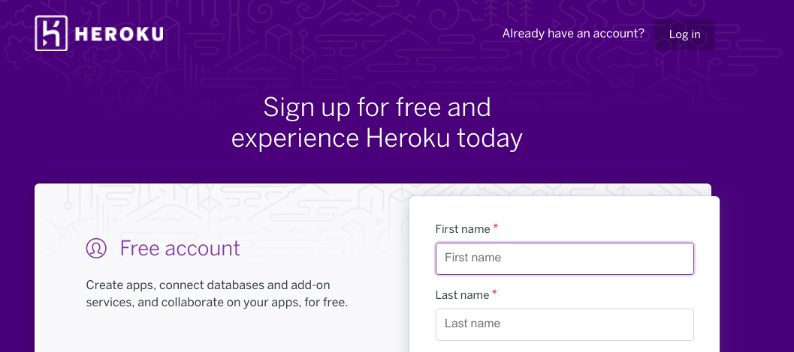
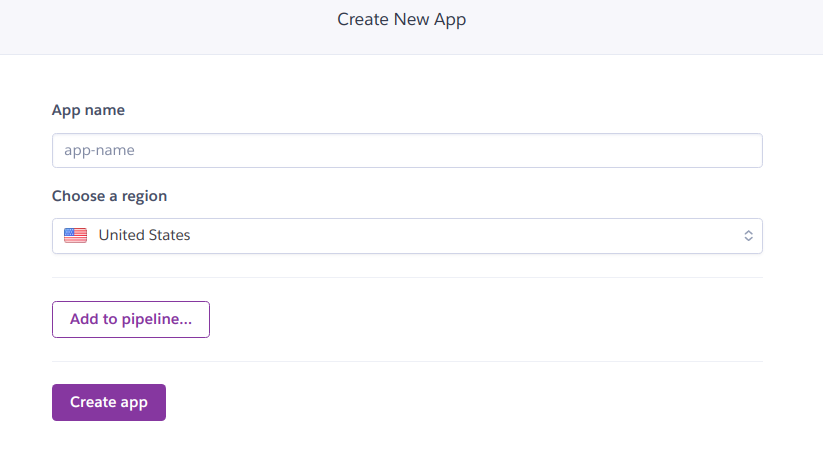
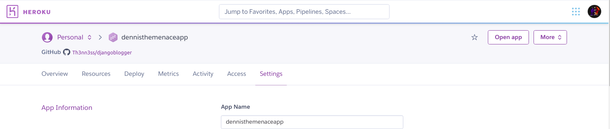
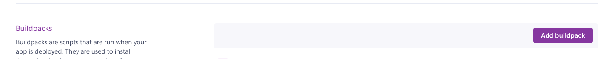
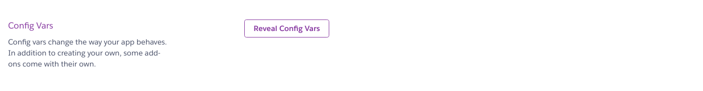
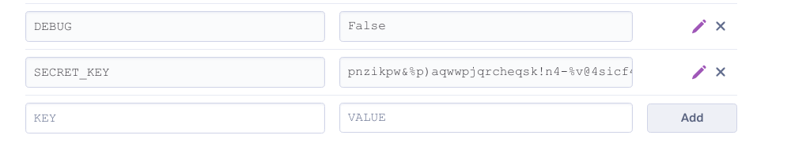
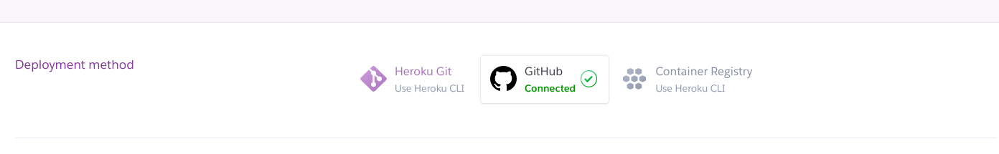
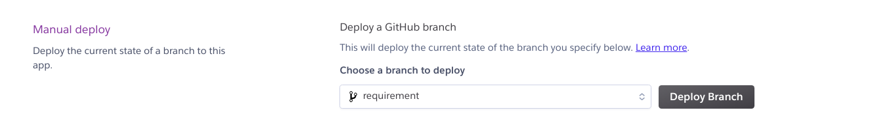

# Django Blogger

This is a simple blog app where users can register and create an account so they can be able to make comments.\
**Link to Web App** [dennisthemenaceapp](https://dennisthemenaceapp.herokuapp.com/) hosted on Heroku\

This documentation is to allow you to be able to deploy the app on Heroku 😊.\
Fork this repository so you can have your own copy.\
Head over to your Heroku dashboard. (if you don't have an account before you can just sign-up, it's free 😎)\
Link to [Heroku](https://www.heroku.com)

\
Create new App

\
Enter the settings tab

\
From _Buildpacks_, click the _Add Buildpacks_ button. From the pop-up select _Python_.

\
Next from _config vars_, click the _reveal vars_ button.

\
Enter the value of SECRET*KEY and DEBUG=False

\
Back at the tabs under the unique app name. Select the \_Deploy* tab, _Deployment Method_ GitHub

\
Enter your github log in details and connect to the appropriate repository you forked.
Next, _Manual deploy_ from the drop down select the branch of the repository you will like to deploy from.

\
With this your app will be deployed and build will commence.
\
**Congratulations your app is now live** 🤘🤘🤘
